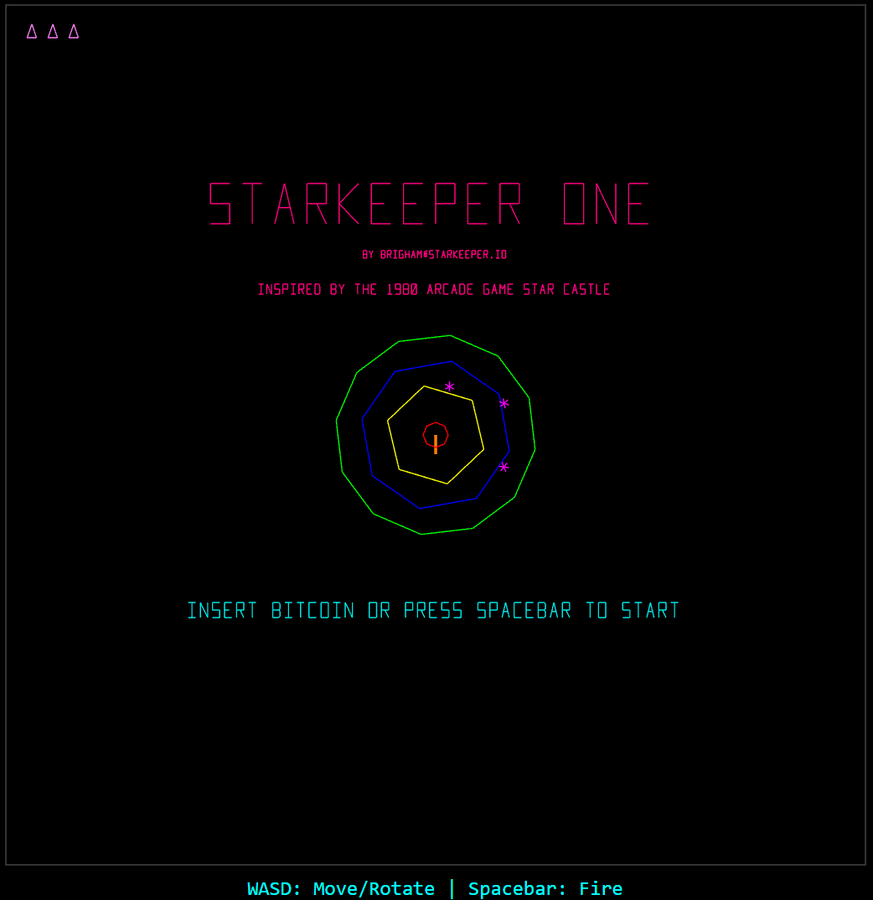

# STARKEEPER ONE

## A modern take on the original classic 1990 arcade game Star Castle

## About

STARKEEPER ONE is a vector-graphics arcade shooter where you pilot a ship around a fortified castle defended by
rotating energy rings. Your goal is to blast through the defensive rings and destroy the reactor core at the center, all
while avoiding enemy sparks and the castle's deadly cannon.

## Running the Game

Clone this repository and open the `index.html` file in a modern web browser with WebGL support.

## Need a Contractor for your Project?

Contact me at contact@starkeeper.io
